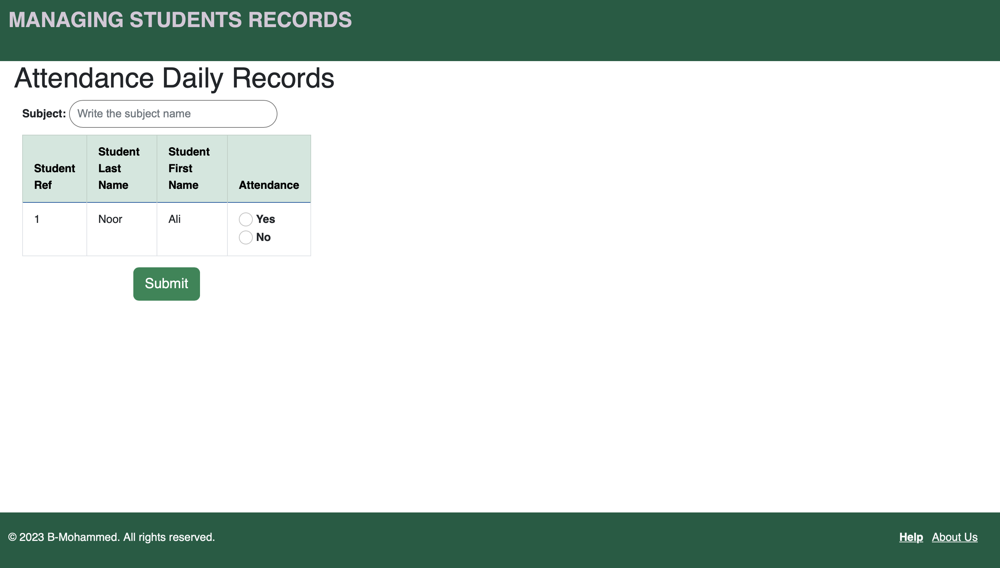

<h1 style="font-size: 24px;">Assignment3</h1>
<h2 style="font-size: 22px;">Student Records Management</h2>

live link to the website
https://record-wep-service.onrender.com

<h2 style="font-size: 22px;">Content</h2>

- [Introduction](#introduction)
  - [Features](#features)
  - [Target audience for web application](#target-audience-for-web-application)
- [User Stories](#user-stories)
  - [Technologies Used](#technologies-used)
  - [Frameworks, Libraries, and Programs used in this project are:](#frameworks-libraries-and-programs-used-in-this-project-are)
      - [Frameworks:](#frameworks)
      - [Libraries:](#libraries)
      - [Programs:](#programs)
      - [CSS and JavaScript:](#css-and-javascript)
- [Design](#design)
  - [SQL Database (PostgreSQL)](#sql-database-postgresql)
    - [First Table](#first-table)
    - [Second Table](#second-table)
  - [Wireframe](#wireframe)
- [Testing](#testing)
  - [Aoutomated tests](#aoutomated-tests)
    - [Lighthouse test](#lighthouse-test)
    - [Validation tests](#validation-tests)
      - [HTML Validation check](#html-validation-check)
      - [CSS Validation check](#css-validation-check)
      - [Python lint validation check](#python-lint-validation-check)
    - [Testing responsiveness](#testing-responsiveness)
      - [Manual test](#manual-test)
    - [Test on different web browsers](#test-on-different-web-browsers)
  - [Test table](#test-table)
- [Bugs and problems encountered](#bugs-and-problems-encountered)
- [Screenshots](#screenshots)
- [User manual](#user-manual)
- [Deployment](#deployment)
- [Security](#security)
    - [Acknowledgment](#acknowledgment)
    - [References](#references)
        - [bootstrap library](#bootstrap-library)
        - [Icone Website https://www.flaticon.com](#icone-website-httpswwwflaticoncom)
        - [bootstrap](#bootstrap)
        - [w3school](#w3school)
- [Code attribution](#code-attribution)

<!-- Introduction -->
# Introduction 
This is a web application page that allows you to perform various operations related to student management. It provides the following features:

## Features

- Add Students: add new students to the system by filling out the form on the "Add Student" page.
- Search for Students:search and retrieve student details using their full name, ID number, or date of birth.
- Update Student Details: Seamlessly update the information of existing students as needed.
- Delete Students: Conveniently remove a student from the system when necessary.
- Student Attendance Register: Maintain and manage daily attendance records for students.
View Student Attendance: Quickly search and view the daily attendance records of students.

## Target audience for web application
I originally created this project for school addministration works to deal with student ditals and mark their daily attendance. 
However,the users of this type of webpage are mostlly working for administration for companies or schools or even some businesses as they can addd data and update or remove it very easley.

# User Stories

* As a user, I want to be able to add a new student to the database with their relevant details, such as their name, gender, date of birth, contact information, address, and next of kin information.
* As a user, I want to be able to search for a student in the database based on their first name and last name, or date of birth, or student reference number.
* As a user, I want to be able to update the details of a student in the database, including their name, gender, date of birth, contact information, address, and next of kin information.
* As a user, I want to be able to remove a student from the database along with their attendance records.
* As a user, I want to be able to view and update the attendance records of students for a particular day, specifying their attendance status for each student.
* As a user, I want to be able to search for a student's attendance records based on their first name, last name, date of birth, or student reference number.
* As a user, I want to be able to access a help section to understand how to use the application effectively.
* As a user, I want to be able to access information about the application and its purpose in an about section.

## Technologies Used

- HTML5: Used for creating the structure and layout of the web page. 
- CSS: Used for styling the web page and adding visual enhancements.
- Python: The programming language used for developing the backend logic of the application.
- PostgreSQL: A powerful open-source relational database management system used for storing and managing student details and attendance data.

## Frameworks, Libraries, and Programs used in this project are:

#### Frameworks:

Flask: A Python web framework used to provide tools and libraries for building web applications. It is used for routing, rendering templates, handling HTTP requests, and more.
#### Libraries:

psycopg2: A PostgreSQL adapter for Python, used for connecting to and interacting with the PostgreSQL database.
os: A module used for accessing the operating system functionalities, in this case, retrieving environment variables.

#### Programs:

PostgreSQL: A popular open-source relational database management system used as the backend database for this project.

#### CSS and JavaScript:

Bootstrap: A popular CSS framework used for styling the web application.
HTML:

Jinja2: A templating engine used in Flask for rendering dynamic content in HTML templates.

______

# Design
I designed the webpage with a clean and minimalist design, using soothing green colors to create a calm and comfortable environment for users. The purpose of the webpage is to serve as an administration tool, providing a pleasant and stress-free experience while performing administrative tasks. By using calming colors, the design aims to have a positive impact on users' mental well-being, promoting a sense of tranquility and ease while working with the webpage.

## SQL Database (PostgreSQL)
PostgreSQL is utilized as the database for this project. It incorporates two tables to enhance the functionality of the web application:

### First Table
The first table is designed to store student details and includes the following columns:
* First Name
* Last Name
* Date of Birth
* Address
* Email Address
* Contact Number
* Next of Kin
* Relationship to Next of Kin
* Next of Kin's Phone Number
* Next of Kin's Email
* Reference Number
This table serves the purpose of storing and managing the personal information and contact details of students.

### Second Table

To facilitate the tracking of students' attendance, a separate table is created. This table consists of the following columns:

* Student ID: A unique identifier for each student.
* Subject: Details of the subjects or courses that students are attending.
* Date: The date on which the attendance is recorded.
* Attendance Status: The status of attendance for each student on a particular date.

This table allows you to keep a record of students' attendance for different subjects or courses, providing valuable information for monitoring and analyzing attendance patterns.

## Wireframe
| Desktop  | Tablet             | Smartpfhone|
| -------- | ------------------ |---------------------- |
||||

_______

# Testing
The purpose of this Test Plan is to outline the testing approach and strategies for ensuring the proper functionality and usability of the web application. The test was devided by aoutomated and manual. Aoutomated tests included (lighthouse,code validation tests). furthumore, the web app was tested manually on different devices such as(Laptop, Tablet, smartphone) regarding responsiveness and functionality.

## Aoutomated tests

### Lighthouse test
The web app was tested on Lighthouse for categories performance, accessibility, best practices, and SEO(Search Engine Optimization) for Mobile devices and Desktops. This is the report as in the images for all web pages:

|page|Desktop|Mobile|
|----|-------|------|
|Home| | |
|Add student| ||
|Search for student|||
|Update student detail|||
|Delete student|||
|Record Student Attendance|||
|Search for student attendance|||

### Validation tests
All the html codes and css codes was tested via W3C validator here is the results:

#### [HTML Validation check](https://validator.w3.org)
During the initial validation process, direct validation of the HTML code containing Jinja templates was not possible due to the presence of dynamic code elements. Therefore, the validation tests were conducted after deploying the web application. The validation process identified and corrected minor spelling errors, such as replacing '<lable>' with '<label>'. Additionally, it was discovered that using a link element '<a>' as a child element of a button element is not allowed, and this issue was resolved accordingly. Following the necessary fixes, the HTML code was revalidated and successfully passed the validation tests.
|page|validation Report|
|-----|---------------|
|Home | |
|Add Student| |
|Search Student| |
|Update Student detail| |
|Delete Student| |
|Record Student Attendance||
|Searching Student Attendance||
|Help| |
|About Us| |

#### [CSS Validation check](https://jigsaw.w3.org/css-validator/#validate_by_upload)

The CSS code was tested by uploading the file via validator. The result was No Errore found.

#### [Python lint validation check](https://infoheap.com/python-lint-online/)

The lint validation ensures that the Python code follows the correct syntax rules and helps identify any potential syntax errors or issues. The successful validation indicates that the code is written in a valid Python syntax according to the lint tool's standards.

___

### Testing responsiveness
The responsiveness of the app was tested Manually on different devices and on google chrom developer tools responsiveness testing.
#### Manual test
the website was tested on different devices such as laptops, smartphones,tablets.
                         
|Device|test & Procedures|Home Page |Add Student page|Search Student page |Update student page |Delete Student page |Record Student Attendance|Search Student Attendance|Help page|About Us page|
|---|---|---|---|---|---|---|---|---|---|---|
|Laptop|Responsiveness||||||||||
|Tablet|Portrait mode||||||||||
|Tablet|Landscape mode||||||||||
|Smartphone|Portrait mode||| |||||||
|Smartphone|Landscape mode||||||||||

### Test on different web browsers
* Safari
*  Chrome
*  Edge

This Test Plan covers a range of test cases, including link navigation, verification of link text and images, and responsiveness across different screen sizes. By following this plan, we aim to identify any functional or usability issues, validate the correctness of the link destinations, and confirm that the web app behaves as expected in different environments.

## Test table
<!-- Tables -->
| Test No | Purpose            | Test and Or data|Expected Outcome|Actual Outcome|Comments|
| --------| ------------------ |-------- |--------|--------|--------|
| 1      |Add student link navigation  ||Opend add student page|Add student web page diplayed||

# Bugs and problems encountered

|Issue    |	Description	       |Solution |
| --------| ------------------ |-------- |
|Inserting data without committing|	Forgot to commit the database transaction after inserting data into a table.|	Ensure to commit the transaction after executing the insert command.|
|Linking CSS and image files|Encountered issues with linking CSS and image files to the website.|	Use the URL method and place all the CSS and image files in the static folder of the web application.|
|Searching for students without Date of Birth|The program crashes when searching for students without providing the Date of Birth.|	Implement an if statement to handle searching with or without the Date of Birth.|
|Handling student details separately in attendance table|Faced difficulty in displaying student details separately from the attendance table to avoid repetition.|	Use conditional statements (e.g., if statement) in Jinja template to show the page without crashing and display the student details when searched for.|
|Multiple data shown when searching attendance by Student ID|When searching for student attendance records by Student ID, multiple records were displayed.|	Modify the SQL query in Python to fetch only the relevant attendance record for the given Student ID.|
|Case sensitivity in search |Search doesn't find data if the input wasn't in the same capitalization as the data in SQL.|Fix by adding the UPPER function to the SQL query to make the search case-insensitive.|

# Screenshots

<!-- how to use the application -->
# User manual

Before running the application, make sure you have the following:
Python 3 installed on your system
PostgreSQL database created on your local machine
In the terminal follow these steps: 
1. pip3 install virtualenv
2. Name the virtualenv : virtualenv 'Name'env
3. Activate virtualenv : ('Name'env/bin/activate)
For Mac (source  'Name'env/bin/activate)
4. pip3 install flask
5. install psycopg2 (pip3 install psycopg2)For Mac (pip3 install psycopg2-binary)
Required Python packages installed. You can install them by running the following command:

<!-- how to set up the program -->
# Deployment
1. creat render account
2. creat postgrasql database in render
3. creat webservice
connect with gethub and outhorize it
install render in github
get all the reposetries from github
connect with the reposetry
instal gunicorn
 make pip >requirments.txt
4. pg admine 
image
explening Use the Server dialog to describe a connection to a server:
http://127.0.0.1:62055/help/help/server_dialog.html
 when connecting from outside 

# Security
To hide sensitive information such as passwords and usernames in a Python application, I used 'os' moudle. This is the process:
First: Import the 'os' module at the top of python file.
Second: Set the sensitive information as environment variables and  give values to the environment variables in sql terminal. for example:
export MY_USERNAME="your_username"
export MY_PASSWORD="your_password"

Third: Access the environment variables in the code wherever needed by only typing the environment value given as the username or password.
'your_username'=os.environ.get['MY_USERNAME'] 
'your_password'=os.environ.get['MY_PASSWORD'] 

this methode allows you to store sensitive information as environment variables and not hardcoded within your code to enhance data protection and security.

### Acknowledgment

### References
##### bootstrap library
##### Icone Website https://www.flaticon.com
##### bootstrap 
##### w3school

# Code attribution

<!-- Italics -->
*This text* is italic

_This text_ is italic

<!-- Strong -->
**This text** is italic

__This text__ is italic

<!-- Strikethrough -->
~~This text~~ is strikethrough

<!-- Blockquote -->
> This is a quote

